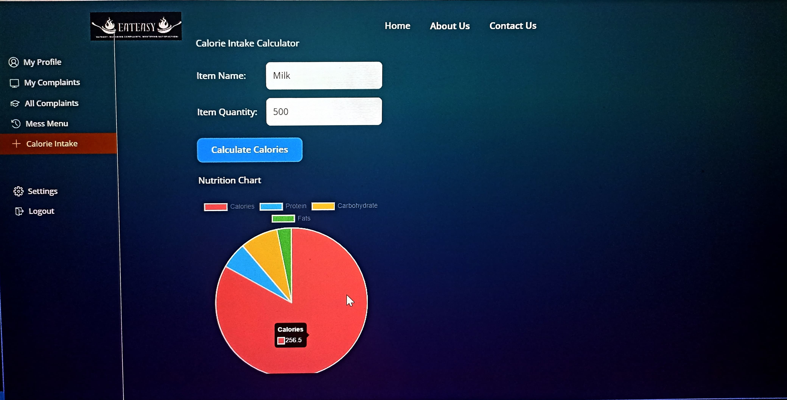
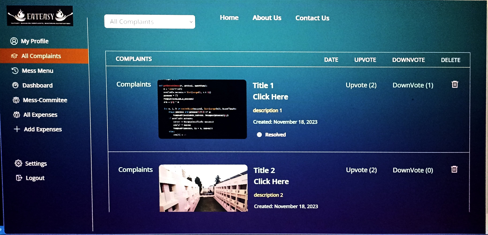
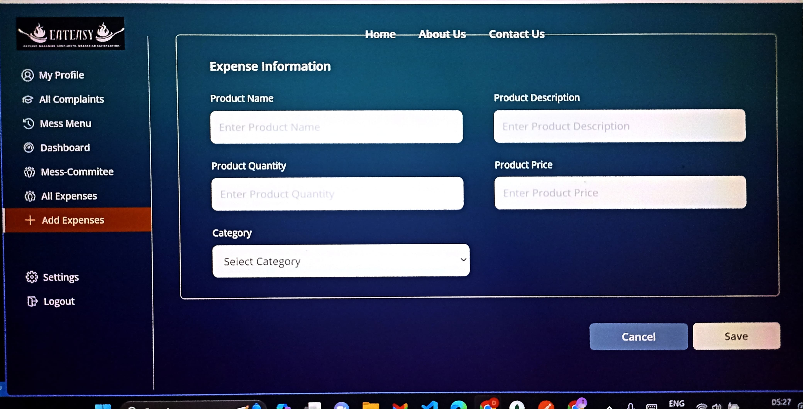
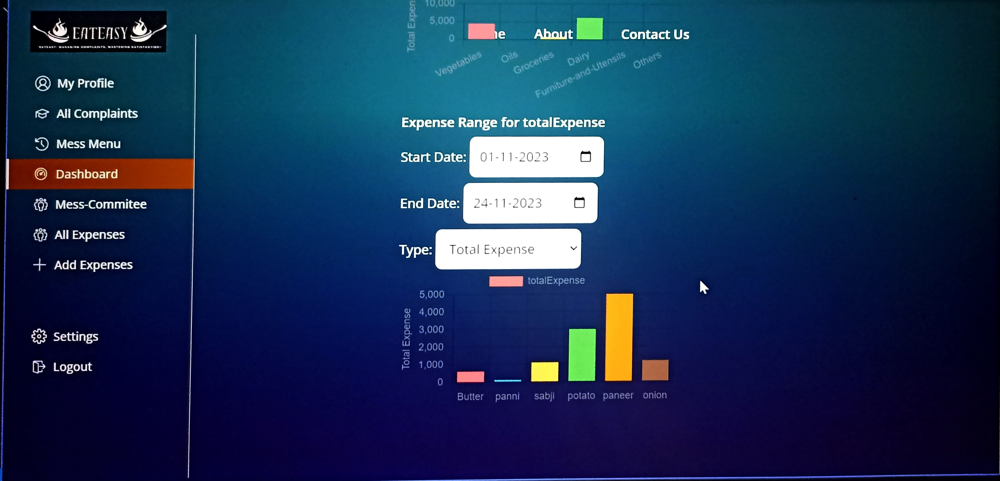
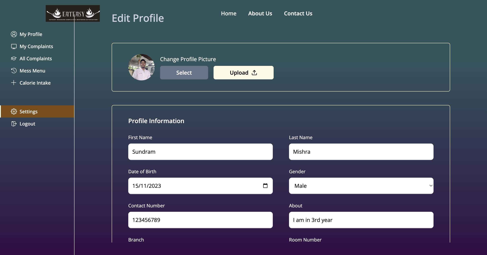

# EATEASY

`MANAGING COMPLAINTS, MASTERING SATISFACTION!`

<div class="album">
  <div class="responsive-container-block bg">
    <div class="responsive-container-block img-cont">
      
      
      
    </div>
    <div class="responsive-container-block img-cont">
      
    </div>
    <div class="responsive-container-block img-cont">
      
  </div>
</div>

For Users:

- Student
- Accountant
- Profs/Chief warden
- Student Representatives/ Appdevs/
  managers
  `It includes the following features :`

- Basic Features

1.  Login/Signup Based on different user roles using their organisation id
2.  User can update their profile pictures
3.  Student portal is hostel specific.
4.  Students can register a new Complaints.
5.  Students can view all complaints (filter available for resolved and unresolved complaints, most vote , most recent)
6.  Students can upvote and downvote a complaint and can also comment on it.
7.  Privileges is given for their hostels only
8.  Accountants, Mess Committee Member and Warden can resolve complaints
9.  Accountant can filter the complaints
10. Accountant can add/edit/delete daily expenses.
11. Accountants can get list of all daily expenses.
12. Accountants can view/edit menu

- Advance Features

1. Rate daily meals breakfast,lunch,supper,dinner seperately
2. Temporarily block a user

3. Display calorie intake for each student based on his input of food.
4. Feature for accountant to track money spent on a particular item for a specific date range
   5.Featuref o raccountantt og e tdetailed analysisofallexpenses(usechartsand
   graphs)

- Additional Features

1. Email Verification (by sending OTP to user’s email and verifying OTP) is done using nodemailer and google Oauth2.0 .
2. User can reset their password using their registered email.
3. User can change the current passwords.
4. Users can update their profile (can add bank details and academic details)
5. Users can delete their accounts.

## Usage

- Create a MongoDB database and obtain your `MongoDB URI` - [MongoDB Atlas](https://www.mongodb.com/cloud/atlas/register)
- Create a Cloudinary account and obtain your `API_KEY API_SECRET` and Create FOLDER_NAME by you won - [Cloudinary](https://cloudinary.com/)

- Get `NUTRITION_API_KEY`
  from [Api Ninja Nutrition](https://api-ninjas.com/api/nutrition)

- Get `CLIENT_ID CLIENT_SECRET REFRESH_TOKEN`
  from [Google Developer Console](https://console.cloud.google.com/welcome?project=eateasy-405214)

### Env Variables

create the `.env` file and add the following

```
#cloudinary details
CLOUD_NAME =
API_KEY =
API_SECRET =
FOLDER_NAME =

PORT =
MONGODB_URL =
JWT_SECRET =

FRONTEND_LINK =

#google.gmail.com
CLIENT_ID =
CLIENT_SECRET =
REFRESH_TOKEN =
USER_EMAIL =

#nutrition api key
NUTRITION_API_KEY =
```

Change the JWT_SECRET to what you want

### Install Dependencies (frontend & backend)

```
npm install
cd server
npm install
```

### Run

```

# Run backend (:4000) & frontend (:3000)
cd server
npm run server

# Run frontend
npm run start
```

## Build & Deploy

```
# Create frontend prod build
npm run build
```
## Contributing
```
We welcome contributions! Please follow the guidelines below:
```

## Workflow
```
Fork the Repository: Click "Fork" on the repository page.

Clone Your Fork:

bash
#Copy code
git clone https://github.com/yourusername/eateasy.git
cd eateasy
Create a New Branch:

bash
#Copy code
git checkout -b feature/your-feature-name
Make Changes: Implement the feature or fix.

#Commit Changes:

bash
#Copy code
git add .
git commit -m "Add feature: your feature description"
#Push to Fork:

bash
#Copy code
git push origin feature/your-feature-name

#Create Pull Request: Open a PR from your fork's branch to the original repository.
```
Feel free to contribute and improve the project!


